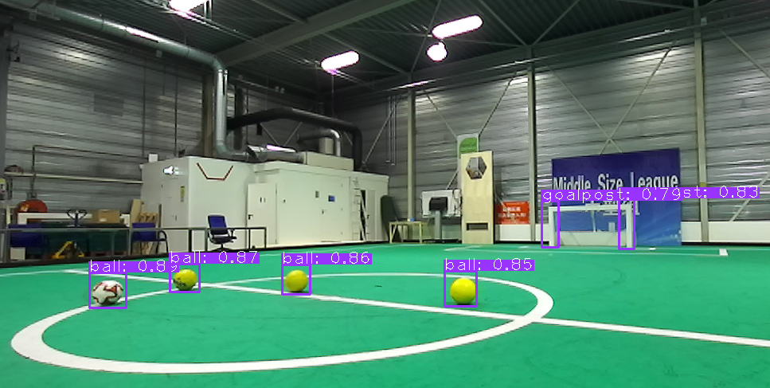

# ZED-YOLOv5



This project shows how to perform [YOLOv5](https://github.com/ultralytics/yolov5) object detection with TensorRT and the [Stereolabs ZED](https://www.stereolabs.com/) stereo depth camera. The code uses the [yolov5-tensorrt](https://github.com/noahmr/yolov5-tensorrt/) library, and is based on one of the examples from this same library. The demo picture above shows its use at [VDL RobotSports](https://robotsports.nl), an industrial team based in the Netherlands participating in the RoboCup Middle Size League.

<div align="center">

[](https://github.com/noahmr/zed-yolov5#setup)
[](https://github.com/noahmr/zed-yolov5#usage)
[](LICENSE)
</div>

## <div align="center">Setup</div>

<details>
<summary>Platforms</summary>
  
- Modern Linux distros
- NVIDIA L4T (Jetson platform)
</details>
  
<details open>
<summary>Dependencies</summary>

- [yolov5-tensorrt](https://github.com/noahmr/yolov5-tensorrt/)
- OpenCV
- ZED SDK (tested with version 3.6.1)
  
</details>

The software can be compiled using CMake and a modern C++ compiler (e.g. GCC)
with support for C++14, using the following steps:

```bash
mkdir build
cd build
cmake ..
make
```
This will build the application ```detect```.
  
  

## <div align="center">Usage</div>

1. Export your YOLOv5 model to ONNX using the official [YOLOv5 guide](https://github.com/ultralytics/yolov5/issues/251).
2. Build the TensorRT engine using the [build_engine](https://github.com/noahmr/yolov5-tensorrt/blob/main/examples/builder/README.md) tool from the yolov5-tensorrt library:

        build_engine --model YOLOV5_MODEL.onnx --output yolov5.engine
   where you replace YOLOV5_MODEL.onnx with the path to the ONNX file generated in step 1.
  
3. Run the ```detect``` application from this project:  

        ./build/detect --engine yolov5.engine --classes coco_names.txt --gui
   this will load the TensorRT engine, open the ZED device, and display the results in a dialog (based on OpenCV highgui). To close the dialog again, press the 'e' key. If you are using a model trained on a custom dataset, you can change "coco_names.txt" to your own list of class names.

<details>
<summary>Notes</summary>
  
- It appears that since [this](https://github.com/ultralytics/yolov5/pull/5699) pull request, the export.py script in the official YOLOv5 repository can now also directly export
to a TensorRT engine, so you could try that instead of steps 1 and 2. However, this has not been tested.
- If you are running the application with an SVO, you might need to change the resolution in the code so that it matches the resolution at which the SVO was recorded. This is the line
  
        initParameters.camera_resolution = sl::RESOLUTION::HD720;
    in ```detect.cpp```
- Currently, only a C++ implementation is available. In the future, a Python implementation will be added as well
</details>

<details>
<summary>Command-line options</summary>
  
Basic usage:
```
./detect --engine ENGINE_PATH
```

Arguments:
- ```-h --help```: shows the help menu
- ```--engine```: [Mandatory] path to the TensorRT engine
- ```--classes```: [Optional] path to the file containing the class names
- ```--gui```: [Optional] Display the results using a GUI (requires OpenCV highgui)
- ```--svo```: [Optional] path to a ZED SVO file (to be used instead of a live sensor)
  
  
</details>

<details open>
<summary>Additional Resources</summary>
  
- [AI at RobotSports (Kaggle)](https://www.kaggle.com/charel/yolov5-1st-place-world-championships-robocup-2021)
</details>

## <div align="center">About</div>

This project, as well as the [yolov5-tensorrt](https://github.com/noahmr/yolov5-tensorrt/) library, are actively developed
at [VDL RobotSports](https://robotsports.nl), an industrial team based in the Netherlands participating in the
RoboCup Middle Size League.


## <div align="center">License</div>

This software is licenced under the MIT license, see [LICENCE.md](LICENCE.md).
